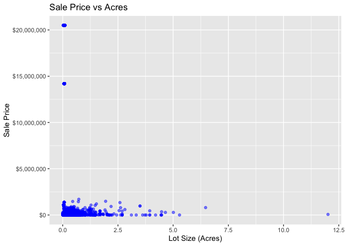

<!-- README.md is generated from README.Rmd. Please edit the README.Rmd file -->

# Lab report \#1

Follow the instructions posted at
<https://ds202-at-isu.github.io/labs.html> for the lab assignment. The
work is meant to be finished during the lab time, but you have time
until Monday evening to polish things.

Include your answers in this document (Rmd file). Make sure that it
knits properly (into the md file). Upload both the Rmd and the md file
to your repository.

All submissions to the github repo will be automatically uploaded for
grading once the due date is passed. Submit a link to your repository on
Canvas (only one submission per team) to signal to the instructors that
you are done with your submission.

# Step 1

``` r
library(remotes)
install_github("heike/classdata")
```

    ## Using GitHub PAT from the git credential store.

    ## Skipping install of 'classdata' from a github remote, the SHA1 (1faa8961) has not changed since last install.
    ##   Use `force = TRUE` to force installation

``` r
library(classdata)
head(ames)
```

    ##    Parcel ID                       Address             Style
    ## 1 0903202160      1024 RIDGEWOOD AVE, AMES 1 1/2 Story Frame
    ## 2 0907428215 4503 TWAIN CIR UNIT 105, AMES     1 Story Frame
    ## 3 0909428070        2030 MCCARTHY RD, AMES     1 Story Frame
    ## 4 0923203160         3404 EMERALD DR, AMES     1 Story Frame
    ## 5 0520440010       4507 EVEREST  AVE, AMES              <NA>
    ## 6 0907275030       4512 HEMINGWAY DR, AMES     2 Story Frame
    ##                        Occupancy  Sale Date Sale Price Multi Sale YearBuilt
    ## 1 Single-Family / Owner Occupied 2022-08-12     181900       <NA>      1940
    ## 2                    Condominium 2022-08-04     127100       <NA>      2006
    ## 3 Single-Family / Owner Occupied 2022-08-15          0       <NA>      1951
    ## 4                      Townhouse 2022-08-09     245000       <NA>      1997
    ## 5                           <NA> 2022-08-03     449664       <NA>        NA
    ## 6 Single-Family / Owner Occupied 2022-08-16     368000       <NA>      1996
    ##   Acres TotalLivingArea (sf) Bedrooms FinishedBsmtArea (sf) LotArea(sf)  AC
    ## 1 0.109                 1030        2                    NA        4740 Yes
    ## 2 0.027                  771        1                    NA        1181 Yes
    ## 3 0.321                 1456        3                  1261       14000 Yes
    ## 4 0.103                 1289        4                   890        4500 Yes
    ## 5 0.287                   NA       NA                    NA       12493  No
    ## 6 0.494                 2223        4                    NA       21533 Yes
    ##   FirePlace              Neighborhood
    ## 1       Yes       (28) Res: Brookside
    ## 2        No    (55) Res: Dakota Ridge
    ## 3        No        (32) Res: Crawford
    ## 4        No        (31) Res: Mitchell
    ## 5        No (19) Res: North Ridge Hei
    ## 6       Yes   (37) Res: College Creek

``` r
typeof(ames)
```

    ## [1] "list"

``` r
summary(ames)
```

    ##   Parcel ID           Address                        Style     
    ##  Length:6935        Length:6935        1 Story Frame    :3732  
    ##  Class :character   Class :character   2 Story Frame    :1456  
    ##  Mode  :character   Mode  :character   1 1/2 Story Frame: 711  
    ##                                        Split Level Frame: 215  
    ##                                        Split Foyer Frame: 156  
    ##                                        (Other)          : 218  
    ##                                        NA's             : 447  
    ##                           Occupancy      Sale Date            Sale Price      
    ##  Condominium                   : 711   Min.   :2017-07-03   Min.   :       0  
    ##  Single-Family / Owner Occupied:4711   1st Qu.:2019-03-27   1st Qu.:       0  
    ##  Townhouse                     : 745   Median :2020-09-22   Median :  170900  
    ##  Two-Family Conversion         : 139   Mean   :2020-06-14   Mean   : 1017479  
    ##  Two-Family Duplex             : 182   3rd Qu.:2021-10-14   3rd Qu.:  280000  
    ##  NA's                          : 447   Max.   :2022-08-31   Max.   :20500000  
    ##                                                                               
    ##   Multi Sale          YearBuilt        Acres         TotalLivingArea (sf)
    ##  Length:6935        Min.   :   0   Min.   : 0.0000   Min.   :   0        
    ##  Class :character   1st Qu.:1956   1st Qu.: 0.1502   1st Qu.:1095        
    ##  Mode  :character   Median :1978   Median : 0.2200   Median :1460        
    ##                     Mean   :1976   Mean   : 0.2631   Mean   :1507        
    ##                     3rd Qu.:2002   3rd Qu.: 0.2770   3rd Qu.:1792        
    ##                     Max.   :2022   Max.   :12.0120   Max.   :6007        
    ##                     NA's   :447    NA's   :89        NA's   :447         
    ##     Bedrooms      FinishedBsmtArea (sf)  LotArea(sf)          AC           
    ##  Min.   : 0.000   Min.   :  10.0        Min.   :     0   Length:6935       
    ##  1st Qu.: 3.000   1st Qu.: 474.0        1st Qu.:  6553   Class :character  
    ##  Median : 3.000   Median : 727.0        Median :  9575   Mode  :character  
    ##  Mean   : 3.299   Mean   : 776.7        Mean   : 11466                     
    ##  3rd Qu.: 4.000   3rd Qu.:1011.0        3rd Qu.: 12088                     
    ##  Max.   :10.000   Max.   :6496.0        Max.   :523228                     
    ##  NA's   :447      NA's   :2682          NA's   :89                         
    ##   FirePlace                            Neighborhood 
    ##  Length:6935        (27) Res: N Ames         : 854  
    ##  Class :character   (37) Res: College Creek  : 652  
    ##  Mode  :character   (57) Res: Investor Owned : 474  
    ##                     (29) Res: Old Town       : 469  
    ##                     (34) Res: Edwards        : 444  
    ##                     (19) Res: North Ridge Hei: 420  
    ##                     (Other)                  :3622

This code explores the ames dataset by first displaying the first few
rows with head(ames) to see what variables are included and checking the
type of the dataset with typeof(ames). Each variable individually:
Parcel ID is a unique 10-digit identifier for each property, Address
includes the house number, street, and city, Style describes the house
style or number of stories, and Occupancy indicates how many people live
in the house. Sale Date records when the house was sold, and Sale Price
shows the sale price, which ranges from \$0 to \$795,000. Multi Sale
indicates whether the house has been sold more than once, though most
entries are missing, and Year Built records the construction year. We
also looked at lot and house size variables: Acres shows the lot size in
acres, TotalLivingArea (sf) measures the total living area in square
feet, Bedrooms counts the number of bedrooms, FinishedBsmtArea (sf)
gives the finished basement area, and LotArea (sf) represents the total
lot area. Additional features include AC, indicating the presence of air
conditioning, FirePlace, indicating whether the house has a fireplace,
and Neighborhood, specifying the neighborhood. To handle missing values,
a new dataset my_df_no_na is created with na.omit(ames), allowing the
code to calculate numeric ranges for variables like total living area,
bedrooms, and finished basement area.

# Step 2 & 3: Area of Interest = Sale Price

``` r
price <- ames$'Sale Price'
range(price)
```

    ## [1]        0 20500000

``` r
names(ames)
```

    ##  [1] "Parcel ID"             "Address"               "Style"                
    ##  [4] "Occupancy"             "Sale Date"             "Sale Price"           
    ##  [7] "Multi Sale"            "YearBuilt"             "Acres"                
    ## [10] "TotalLivingArea (sf)"  "Bedrooms"              "FinishedBsmtArea (sf)"
    ## [13] "LotArea(sf)"           "AC"                    "FirePlace"            
    ## [16] "Neighborhood"

``` r
str(ames$`Sale Price`)
```

    ##  num [1:6935] 181900 127100 0 245000 449664 ...

``` r
library(ggplot2)

#Histogram of house prices, nearly impossible to see distinctions due to massive range
ggplot(ames, aes(x = `Sale Price`)) +
  geom_histogram(binwidth = 50000, fill = "skyblue", color = "black") +
  labs(
    title = "Distribution of Sale Prices",
    x = "Sale Price (USD)",
    y = "Number of Properties"
  ) +
  theme_minimal()
```

<!-- -->

``` r
#Histogram with log scale to make trends easier to see. 
ggplot(subset(ames, `Sale Price` > 0), aes(x = `Sale Price`)) +
  geom_histogram(bins = 50, fill = "skyblue", color = "black") +
  scale_x_log10() +
  labs(
    title = "Distribution of Sale Prices (Log Scale)",
    x = "Sale Price (log10 scale)",
    y = "Number of Properties"
  ) +
  theme_minimal()
```

<!-- -->

The variable of special interest / focus is certainly the ‘Sale Price’
variable. The range of this variable is from \$0 to \$20,500,000.The
genereal pattern is a large spike approximately around \$150,000 to
\$350,000 (Difficult to tell for certain).

# Step 4

Betsy’s work:

``` r
range(ames$Acres, na.rm = TRUE)
```

    ## [1]  0.000 12.012

The lot size (Acres) ranges from 0.02 to about 2.3 acres. Most houses
are on small lots, with a few much larger lots (possible outliers).

``` r
ggplot(ames, aes(x = Acres)) +
  geom_histogram(binwidth = 0.05, fill = "skyblue", color = "black") +
  labs(title = "Histogram of Lot Size (Acres)",
       x = "Acres", y = "Count")
```

    ## Warning: Removed 89 rows containing non-finite outside the scale range
    ## (`stat_bin()`).

<!-- -->

The distribution is right-skewed: most houses are on small lots (\<0.5
acres), and a few properties have very large lots. There are some
extreme values (outliers) on the high end.

``` r
ggplot(ames, aes(x = Acres, y = `Sale Price`)) +
  geom_point(alpha = 0.5, color = "blue") +      # make points semi-transparent
  labs(title = "Sale Price vs Acres",
       x = "Lot Size (Acres)", y = "Sale Price") +
  scale_y_continuous(labels = scales::dollar_format())
```

    ## Warning: Removed 89 rows containing missing values or values outside the scale
    ## range (`geom_point()`).

<!-- --> - There is a
positive relationship: houses on larger lots tend to have higher sale
prices. - Most points cluster at small lot sizes, but a few large-lot
houses have much higher sale prices, contributing to the skew in
SalePrice. - These extreme points may explain some oddities observed in
SalePrice, like very high sales.

Colin’s Work:

``` r
sqft <- ames$`TotalLivingArea (sf)`
range(ames$`TotalLivingArea (sf)`, na.rm = TRUE)
```

    ## [1]    0 6007

``` r
#Plot
ggplot(subset(ames, `TotalLivingArea (sf)` > 0), 
       aes(x = `TotalLivingArea (sf)`)) +
  geom_histogram(bins = 40, fill = "lightblue", color = "black") +
  labs(
    title = "Distribution of Total Living Area",
    x = "Total Living Area (sq. ft.)",
    y = "Number of Properties"
  ) +
  theme_minimal()
```

<!-- -->

The variable I chose is “TotalLivingArea (sf).” The range of the
variable is 0 to 6,007.

``` r
#Removed outliers since the most expensive houses made it impossible to see a trend
ggplot(subset(ames, 
              `TotalLivingArea (sf)` > 0 & 
              `Sale Price` > 0 & 
              `Sale Price` <= 1000000),
       aes(x = `TotalLivingArea (sf)`, y = `Sale Price`)) +
  geom_point(alpha = 0.5, color = "steelblue") +
  labs(
    title = "Sale Price vs. Square Footage (Excluding Outliers)",
    x = "Square Footage",
    y = "Sale Price"
  ) +
  theme_minimal()
```

<!-- -->

## The overall pattern is a positive semi-linear relationship such that the sale price increases as the square footage increases. While the oddities don’t show up on the chart, the outliers make this relationship much weaker. The most expensive houses aren’t necessarily the biggest, they were generally between 500 and 1,500 square feet, which seems incredibly small for how much the houses were sold for.

### Tirtho’s Analysis: Year Built vs Sale Price

``` r
# Year Built analysis
range(ames$YearBuilt, na.rm = TRUE)
```

    ## [1]    0 2022

``` r
# Scatter plot with trend line
ggplot(ames, aes(x = YearBuilt, y = `Sale Price`)) +
  geom_point(alpha = 0.4, color = "steelblue") +
  geom_smooth(method = "lm", color = "red", se = TRUE) +
  scale_y_continuous(labels = scales::dollar_format()) +
  labs(
    title = "Sale Price vs. Year Built",
    subtitle = "Ames Residential Properties",
    x = "Year Built",
    y = "Sale Price"
  ) +
  theme_minimal()
```

    ## `geom_smooth()` using formula = 'y ~ x'

    ## Warning: Removed 447 rows containing non-finite outside the scale range
    ## (`stat_smooth()`).

    ## Warning: Removed 447 rows containing missing values or values outside the scale
    ## range (`geom_point()`).

<!-- -->

``` r
# Correlation
cor(ames$YearBuilt, ames$`Sale Price`, use = "complete.obs")
```

    ## [1] 0.1533749

``` r
#My findings: I chose YearBuilt as my variable. There is a weak positive relationship (r = 0.15) between year built and sale price. While there is some tendency for newer homes to command higher prices, the relationship is weaker than expected, with considerable variation. Some older homes (pre-1950) sell for high prices, likely due to historic value or renovations. Notable outliers include homes built around 2000-2010 selling for $400,000+. The weak correlation suggests that other factors (like square footage, location, or quality) may be more important predictors of sale price than age alone.
```
